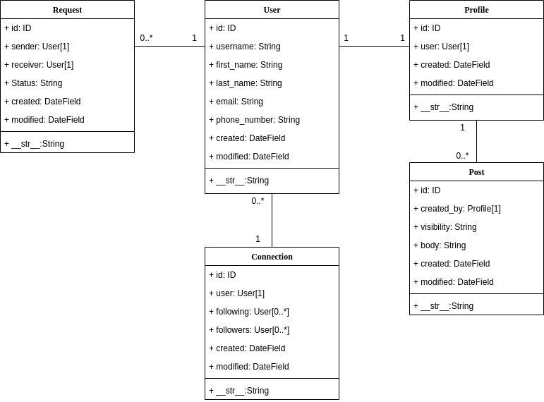

# MyDea

This is MyDea, a solution to the django backend technical test from Z1 Digital presented by Alvaro Rubio Gomez

<a href="https://github.com/pydanny/cookiecutter-django/">
</a>

<a href="https://github.com/ambv/black">
</a>

License: **MIT**

## Requirements
* [Docker engine](https://docs.docker.com/engine/)
* [Docker compose](https://docs.docker.com/compose/)

## Run MyDea

### Build docker

It is highly recommended to create a python [virtual environment](https://docs.python.org/3/library/venv.html) to avoid dependency conflicts with other projects.

After you have cloned the mydea repository, build the docker by running inside the project root folder:

```
export COMPOSE_FILE=local.yml
docker-compose build
```
And wait until it is finished.

### Make and run migrations

After the docker build has finished, run the migrations to reflect the models inside the database by running:

```
docker-compose run --rm django python manage.py makemigrations
docker-compose run --rm django python manage.py migrate
```

### Populate the database

When building the project, the database is going to be empty. For the seek of testing the app, the project includes django fixtures and a script for populating the database with mock-up data.<br>

To populate the database simply run:
```
docker-compose run --rm django python manage.py loaddata mydea/fixtures/*.json
docker-compose run --rm django python manage.py runscript set_up_db_data
```

The mock-up data is created by the data generator [Mockaroo](https://www.mockaroo.com/) and it contains:
* 10 users.
* 10 profiles.
* 10 connections with a random number of followings and followers users.
* 40 posts randomly associated to each user.
* 30+ requests between sent and accepted ones.

### Run the project

Up the server by running:
```
docker-compose up
```

## Try MyDea

After the project is up, you can consult and perform the graphql queries and mutations in `http://localhost:8000/graphql`

Alternatively, you can use postman and import the files located in the postman folder, which contains examples of all the queries and mutations of MyDea.
 
To access the admin site at `http://localhost:8000/admin` you need to create a superuser first by running:
```
docker-compose run --rm django python manage.py createsuperuser
```
In the admin site you can consult, add and delete instances to your database.

## Testing

MyDea has been developed following the TDD methodology. 
Each app folder contains a `tests` folder where you can consult all the unit tests performed.

Run all the unit tests by running:
```
docker-compose run --rm django pytest -v
```

## Technical test & solution

### Query/Mutation : Actions

Below you can see a list of the actions a user can perform and the corresponding query or mutation name that covers that action.
* **register**: *Un usuario puede registrarse introduciendo su email y eligiendo un nombre de usuario libre y una contraseña*
* **login**: *Un usuario debe ser capaz de logarse utilizando email y contraseña.*
* **passwordChange**: *Un usuario debe poder cambiar su contraseña.*
* **sendPasswordResetEmail**: *Un usuario debe poder restaurar su contraseña recibiendo un email con un magic link.*
* **createPost**: *Un usuario puede publicar una idea como un texto corto en cualquier momento.*<br>
*Un usuario puede establecer la visibilidad de una idea: publica (todos pueden verla), protegida (solo otros usuarios que siguen al usuario de la idea pueden verla) y privada (solo el usuario que creó la idea puede verla)*
* **editVisibility**: *Un usuario puede establecer la visibilidad de una idea en el momento de su creacion o editarla posteriormente.*
* **myPosts**: *Un usuario puede consultar todas las ideas que ha publicado ordenadas de mas recientes a mas antiguas.*
* **deletePost**: *Un usuario puede borrar una idea publicada.*
* **sendRequest**: *Un usuario puede solicitar seguir a otro usuario*
* **myRequests**/**resolveRequest**: *Un usuario puede ver el listado de solicitudes de seguimiento recibidas y aprovarlas o denegarlas*
* **myFollowing**: *Un usuario puede ver el listado de gente a la que sigue*
* **myFollowers**: *Un usuario puede ver el listado de gente que le sigue*
* **deleteFollowing**: *Un usuario puede dejar de seguir a alguien*
* **deleteFollowers**: *Un usuario puede eliminar a otro usuario de su lista de seguidores*
* **findUsers**: *Un usuario puede realizar una busqueda de otros usuarios introduciendo un nombre de usuario o parte de uno*
* **userPosts**: *Un usuario puede ver la lista de ideas de cualquier otro usuario, teniendo en cuenta la visibilidad de cada idea.*
* **allPosts**: *Un usuario puede ver un timeline de ideas compuesto por sus propias ideas y las ideas de los usuarios a los que sigue, teniendo en cuenta la visibilidad de cada idea.*
* **TBD**: *Un usuario debe recibir una notificación cada vez que un usuario al que sigue publica una idea nueva a la que tiene acceso.*

### Models

Below you can see the MyDea models diagram. Request and connection models are related to the User model while the Post model relates to the Profile model.
This is just a design choice due to it makes sense that posts are directly connected to the user's profile.



### To Be Done (TBD)

Good coding requires time and time is precious. There are a few things that has been left to be done:
- The last user action where the user's followers receive a new post notification. The Notification model would be related to the User model as a many-to-one relationship, where a user has one notification list but a notification list can have many users.
- The process of updating the notification list for every user's follower can slow the server response proportionally to the number of users. For this reason, it would be advisable to outsource this task with a taks queue as [Celery](https://docs.celeryproject.org/en/stable/getting-started/introduction.html) with the help of a message broker as [Redis](https://redis.io/).
- Request queries and mutations requires some additional validations. Due to lack of time, there might be certain undesired behaviors such as duplicating requests, sending request to yourself, etc.<br>
These can be easily fixed by adding certain validations.
- Error handling. A model error has been built for formatting validation errors. However, other types of errors have their own format and they are just not consistent with each other. A proper error handling design should be performed.